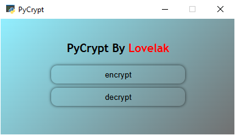
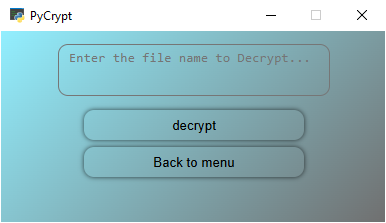

# PyCrypt - Password Encryption Tool

A simple GUI-based password encryption and decryption tool built with Python and HTML/JavaScript.

## Features

- User-friendly graphical interface
- Secure password encryption using random hex tokens
- Password decryption functionality
- File-based storage of encrypted passwords

## Screenshots

  

## Requirements

```python
pip install pywebview
pip install pyautogui
```

## Usage

1. Run [main.py](main.py) to start the application
2. Choose between encryption or decryption options

### Encryption

1. Click the "encrypt" button
2. Enter the password you want to encrypt
3. Click encrypt - this will create a file named `KEY-[random].txt` containing your encrypted password

### Decryption

1. Click the "decrypt" button
2. Make sure the encrypted KEY file is in the same directory as the tool
3. Enter the file name without the `.txt` extension
4. Click decrypt - this will create a file named `DECRYPTED-[random].txt` with your decrypted password

## How It Works

- The encryption process adds random hex values to each character of your password
- The decryption process extracts the original characters from the encrypted file
- Files are automatically generated with random names for security

## Files

- [main.py](main.py) - Contains the core encryption/decryption logic
- [src/index.html](src/index.html) - The GUI interface

## Author

Created by Lovelak

## Note

This is a basic encryption tool meant for learning purposes. For sensitive data, please use established
